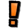

# Hello! I made this bc I was bored..

# How to use CurrentVector Reanimate 

## <a:Sadge:1401272411147730985> First, have an Executor with atleast 90-UNC / 90-sUNC. (VERY IMPORTANT)
### *! Lower UNC/sUNC executors may not work correctly !*

### I recommend *[Nexomia](https://nexomia.win)* if ur on PC 

## Second, run Reanimate, then wait 5 seconds. (To make sure ur character is fully reanimated and ready)

## Third, run CVD1 (CurrentVectorDancesV1) and thats all!

*Reanimate:* `loadstring(game:HttpGet("https://raw.githubusercontent.com/nonmex9-design/CurrentVector-Reanimate/refs/heads/main/Reanimate.luau"))()`

*CVD1:* `loadstring(game:HttpGet("https://raw.githubusercontent.com/nonmex9-design/CurrentVector-Reanimate/refs/heads/main/CVD1.luau"))()`

### Loadstrings:

*Reanimate:* `loadstring(game:HttpGet("https://raw.githubusercontent.com/nonmex9-design/CurrentVector-Reanimate/refs/heads/main/Reanimate.luau"))()`

*CVD1:* `loadstring(game:HttpGet("https://raw.githubusercontent.com/nonmex9-design/CurrentVector-Reanimate/refs/heads/main/CVD1.luau"))()`

*KD3:* `loadstring(game:HttpGet("https://raw.githubusercontent.com/nonmex9-design/CurrentVector-Reanimate/refs/heads/main/KD3.luau"))()`

  

